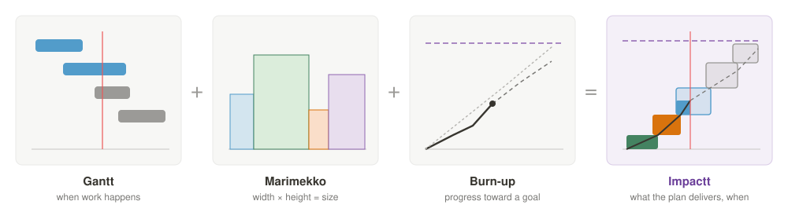
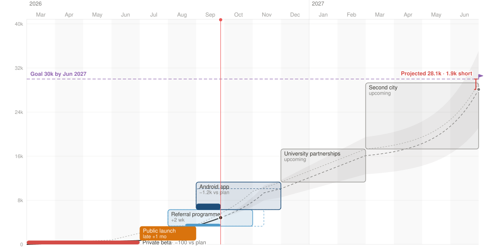
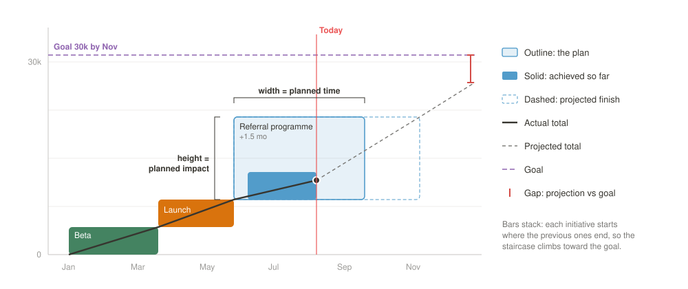

# Impactt

**A chart that answers the question most roadmaps can't:
_will the work we planned actually get us to our goal, and when?_**

<a href="docs/video/impactt-explainer.mp4">
  
</a>

The animation is a cut from the
**[68-second explainer](docs/video/impactt-explainer.mp4)** (with sound),
which follows one enterprise example from roadmap to projection.

Impactt is a new chart type created by **Matthias**
([matthias.digital](https://matthias.digital)). It combines three well-known
charts into one picture:

| Borrowed from   | What it contributes                                                                      |
| --------------- | ---------------------------------------------------------------------------------------- |
| **Gantt chart** | Every initiative is a bar on a timeline: when it's planned, started and finished.         |
| **Marimekko**   | Bars have two meaningful dimensions: the **width** is time, the **height** is impact.     |
| **Burn-up**     | Bars stack toward a **goal line**, with the plan, actual and projected totals over time.  |



Each initiative is drawn as a block. Its width is its duration and its height
is the KPI change it delivers. Blocks stack from the KPI's starting value
toward its goal. At a glance you can see:

- which pieces of work carry the target,
- which are late or under-delivering,
- and whether all of them together still reach the goal by the promised date.

<picture>
  <source media="(prefers-color-scheme: dark)" srcset="docs/impactt-chart-dark.svg">
  
</picture>

This repository contains Impactt as a **Notion custom block**. The same chart
is also a standalone, shareable
**[Claude artifact](https://claude.ai/artifact/5646C96dx3gznmWJykuqF3)**:
paste your data as JSON and use it without Notion.

---

## Why Impactt

Roadmaps and KPI dashboards usually live apart:

- A **Gantt chart** shows _when_ things happen, but not _what they're worth_.
  A two-week tweak and a quarter-long bet look alike if they last as long.
- A **burn-up chart** shows progress toward a target, but not _which work_
  produced it, or which planned work is missing.
- A **KPI dashboard** shows where a number is today, but not whether the
  plan that's supposed to move it is on track.

Impactt puts the plan and the outcome on the same canvas. Each initiative
shows three things, and the chart adds them up against the goal:

- its promise: the planned impact,
- its evidence: the impact achieved so far,
- its forecast: the projected impact and end date.

### How to read it



- **Bar width:** the planned window (translucent), the actual run (solid) and
  the projected run (dashed outline).
- **Bar height:** the KPI change. The outline is the planned change, the solid
  fill is what's achieved so far, and the dashed outline is the projection.
  Burndown KPIs such as churn or cost stack downward.
- **Bar colour:** the status. It is one of upcoming, on track, delayed, won't
  meet, done and met, done but impact missed, or done late.
- **Lines:**
  - the plan total (dotted),
  - the actual total up to today (solid),
  - the projection (dashed), with an uncertainty range,
  - the goal (purple).
- **Gap marker:** how far the projection lands above or below the goal on
  the goal date.
- **Tooltip:** hover over or click a bar to compare planned, achieved and
  projected impact, plus dates and deviation.

### When a plan slips

Every initiative has a rule for what happens if it runs behind:

- **Timeline moves:** the impact is kept and the end date slips. This suits
  scope-fixed work that ships when it's done.
- **Impact changes:** the date is fixed and the impact shrinks or grows. This
  suits date-fixed work such as a launch, a campaign or a season.

Growth can be **linear** or **exponential**. Exponential suits things that
start slow, like referral loops, and changes how the projection extrapolates.

---

## Using Impactt in product and project management

**Product management**

- **Outcome roadmaps:** show the roadmap as bets against a North Star metric
  or an OKR, not as a list of features. Stakeholders see what each bet is
  worth.
- **Prioritisation:** tall, narrow bars are fast wins with high impact. Short,
  wide bars are slow work with low impact. The shape makes trade-offs
  visible.
- **Goal-setting:** set the goal "from plan" (the sum of planned impact) or as
  a custom target. You see immediately whether the plan is ambitious enough
  to reach it.
- **Reviews and retros:** finished bars keep their plan outline, so "planned
  +5k, delivered +2.6k" stays visible long after the launch.

**Project and portfolio management**

- **Delivery tracking:** delays show up as dashed extensions and colour
  changes, and the chart shows how much they move the overall goal.
- **Portfolio view across KPIs:** average mode (described below) folds
  several KPIs into one "% of goal reached" scale. A portfolio of initiatives
  that touch different metrics can then be judged together.
- **Effort and budget tracking:** chart effort (hours, person-days, cost)
  instead of an outcome. Bars are estimates, the fill is what's spent, the
  goal line is the budget, and the projection shows whether the portfolio
  will overrun it.
- **Team and owner views:** filter by team, owner, status or any other
  property to see one team's contribution to a shared goal.
- **Steering meetings:** the chart makes statements like "we're projected
  1.9k short of the goal, mainly because the Android app is ramping slowly"
  easy to see and to show.

---

## The Notion block

The block renders Impactt inside a Notion page and reads live from your
Notion databases.

### Features

- **Live data** from Initiatives, plus Impacts and KPIs where you use them.
  KPIs can also live directly on Initiatives as number columns.
- **Notion-style filter bar**, built from your Initiatives database. Every
  property can be filtered, whatever its type:
  - text, numbers and checkboxes,
  - selects, grouped statuses and multi-selects,
  - people (including "Me") and relations,
  - dates, including dates relative to today, with a calendar,
  - files, formulas and rollups.

  Simple filters appear as chips. The advanced filter supports And / Or
  rules and groups.
- **Chart settings** in a Notion-style panel (the sliders icon). Here you
  choose one or more KPIs, where the KPIs come from, the goal, the
  default "If off plan" rule, which lines to show, and whether to show the
  table. The panel also has a legend.
- **Write-back:** changing "If off plan" or "Growth" in the table updates the
  initiative in Notion. Changing the goal value or date in the settings
  updates the KPI.
- **Light and dark mode** follow Notion, and the layout adapts to narrow
  pages.

### Set up your databases

**Initiatives** has one row per piece of work. Any extra properties you have,
such as Team, Owner, Status or Tags, can be filtered on automatically.

| Property    | Type   | Meaning                                                                 |
| ----------- | ------ | ----------------------------------------------------------------------- |
| Name        | title  | Bar label                                                               |
| Plan        | date   | Planned window, as a date range. A single date plans the whole month.   |
| Started     | date   | Actual start, when it differs from the plan                             |
| Done        | date   | Actual finish, once the initiative is complete                          |
| If off plan | select | `Timeline moves` or `Impact changes`. Empty uses the block default.     |
| Growth      | select | `Linear` or `Exponential`                                               |
| Note        | text   | Shown in the tooltip                                                    |

**Impacts** has one row per initiative and each KPI it moves. It's optional
if you keep KPIs on Initiatives instead (see below).

| Property   | Type                             | Meaning                                                                      |
| ---------- | -------------------------------- | ---------------------------------------------------------------------------- |
| Name       | title                            | Anything, for example "Android app → WAU"                                    |
| Initiative | relation                         | The initiative                                                               |
| KPI        | relation, select or multi-select | The KPI or KPIs. Choose the column under Settings → KPI → KPIs from.         |
| Planned    | number                           | Planned change (negative for burndown KPIs)                                  |
| Achieved   | number                           | Change achieved so far                                                       |

**KPIs** is optional. It adds details for the KPIs named in Impacts, matched
by relation or by the same title.

| Property  | Type   | Meaning                                                     |
| --------- | ------ | ----------------------------------------------------------- |
| Name      | title  | KPI name                                                    |
| Unit      | select | `Number`, `Percent`, `EUR` or `USD`                         |
| Baseline  | number | Value before the first initiative                           |
| Direction | select | `Increase` or `Decrease`                                    |
| Goal      | number | Target. When empty, the goal is the plan total.             |
| Goal by   | date   | When the goal should be reached                             |
| Range ±   | number | Projection uncertainty: `0.3` or `30` means ±30% (default)  |
| Kind      | select | `Impact` or `Effort`. Empty guesses from the name.          |

A KPI without a row in the KPIs database is treated as follows:

- It starts at 0 as a plain number.
- A €, $ or % in its name sets the unit.
- If all its impacts are negative, it's a "decrease" KPI.
- Its goal comes from the plan.

### KPIs directly on Initiatives

You don't need an Impacts database if each initiative carries its numbers
itself. Add number (or formula / rollup) columns in pairs named
`<KPI> planned` and `<KPI> achieved`, for example `Revenue planned` and
`Revenue achieved`. `plan`, `target` and `estimate` work for the first,
`actual`, `now`, `current`, `spent`, `used` and `delivered` for the second.
Then choose **Settings → KPI → KPIs from → Initiatives columns**. A KPIs row
with the same title (`Revenue`) still adds unit, baseline and goal.

### Effort instead of impact

Impactt works for effort as well as outcomes, for example to see how much
effort you've used and how much you still intend to use. Mark a KPI as
effort with **Kind = Effort** in the KPIs database, or give it a name like
"Effort", "Hours" or "Person-days". Then:

- the bar height is the estimate and the fill is the effort spent,
- the goal line is the **budget**, and the gap reads "over budget" or
  "under budget",
- spending more than estimated is the bad case: statuses read "Done, over
  effort" or "Will overrun" instead of "Impact missed".

The sample data has `Effort planned` and `Effort spent` columns on
Initiatives to try this.

### Choosing KPIs and average mode

The KPI page in the settings lists every KPI with a checkmark:

- **One KPI** is charted in its own unit (users, €, %).
- **Several KPIs**, or **All KPIs · average**, are charted as the average
  percentage of goal reached. For two KPIs out of four, only those two count.
- **Include all initiatives** also brings in initiatives that move none of
  the chosen KPIs. They share the 100% too and are judged by delivery: a
  done initiative has reached its share, the others count as planned.

In average mode:

- Every initiative that moves at least one chosen KPI gets an equal share of
  a 100% goal. With 9 initiatives, that's 11.1% each.
- For each KPI it moves, the initiative's reach is achieved ÷ planned, capped
  at ±300%. Its achieved share is its share times the average of those
  reaches. An initiative at 50% on one KPI and 100% on another has reached
  75% of its share.
- The goal date is the latest goal date among the chosen KPIs.
- Filters apply first, so the 100% is split among the initiatives still
  visible.

### Add it to Notion

Custom blocks need a Business or Enterprise workspace and the
[`ntn` CLI](https://www.npmjs.com/package/ntn).

```zsh
npm install --global ntn
cd impactt-view
npm install
ntn login
ntn workers deploy --name impactt-view
```

In a Notion page, type `/custom` and choose the Impactt block. Then connect
**Initiatives** and, if you use them, **Impacts** and **KPIs**. Until the
databases are connected, the block shows a setup hint.

---

## The Claude artifact

**[Open the Impactt artifact](https://claude.ai/artifact/5646C96dx3gznmWJykuqF3)**

The artifact is the same chart as a standalone web page, with no Notion
needed. Use it to:

- try Impactt with sample data before setting up any databases,
- model a plan in a workshop, then paste the JSON into the "Edit data" panel,
- share a picture of a roadmap with people outside Notion.

Its data format mirrors the databases above:

- `kpis`, each with `base`, `direction` and `goal`.
- `initiatives`, each with:
  - a `plan` window,
  - optional `start` and `done` dates,
  - `timing` and `growth`,
  - an `impact` entry per KPI, `{ plan, now }`.

---

## Development

```zsh
cd impactt-view
npm install
npm run check                    # type-check worker + block
npm test                         # unit tests (filters, dataset, model)
ntn workers customblocks dev     # Notion mock host at localhost:9873
```

The dev shell connects the sample databases in `data/` automatically. They
contain the Impactt sample: 9 initiatives, 5 KPIs (one of them effort) and
16 impact rows. They also include extra properties to filter on, a "KPI tag"
select for trying out a different KPI column, and `Effort planned` /
`Effort spent` columns on Initiatives. Restart the dev shell after editing the files.

To run the block without any Notion host:

```zsh
cd blocks/impactt-view && npx vite
```

Then open `http://localhost:5173/?mock=1`. Add `&theme=dark` for dark mode,
or `&scenario=loading` / `&scenario=unbound` for those states.

### How filtering works

- **Why the block filters itself:** the SDK's own filters only combine simple
  conditions with AND. They have no people, relation or formula filters and
  no relative dates. So the block reads up to 999 rows per database and
  applies Notion's filter rules itself.
- **What changes on the chart:** filtered-out initiatives leave the chart,
  and the stacking, totals and projections are recalculated.
- **Where filters are stored:** filters and view settings are remembered per
  block in each viewer's browser. The SDK has no shared storage for blocks,
  so other viewers don't see your filters.

### Project structure

```text
src/index.ts                 Worker: the block and its data-source schemas
blocks/impactt-view/src/
  main.tsx                   Hosted root and ?mock=1 harness
  useImpacttData.ts          Notion data layer: queries, names, write-backs
  mockData.ts                Sample data for the harness
  dataset.ts                 Databases → chart data, KPI column, average mode
  model.ts                   Time axis, projections, goal
  chart.ts                   SVG renderer, tooltip, labels, drag-scroll
  ImpacttView.tsx            Toolbar, time bar, table, footnotes
  SettingsPanel.tsx          Notion-style settings panel
  filters/                   Filter engine, filter bar, editors, popovers, icons
  impactt.css                Notion light/dark palette and styles
data/                        Sample databases for the dev shell
docs/                        README graphics (chart renders are exported from the block)
docs/video/                  The explainer film: film.html, cue sheet, score, renderer
test/                        Unit tests
```

### Limitations

- The block reads up to 999 rows per database. A footnote appears if data is
  cut off.
- The dev shell can't save changes to its sample rows and reports "page not
  found". Write-back works in real Notion.
- The dev shell doesn't provide Notion's built-in created/edited properties
  or option colours. The `?mock=1` harness includes them.
- People appear as initials; profile pictures aren't loaded.

---

Impactt was created by Matthias. The block is built with the Notion Workers
SDK and [Claude](https://claude.ai).
